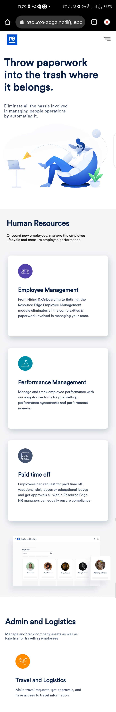
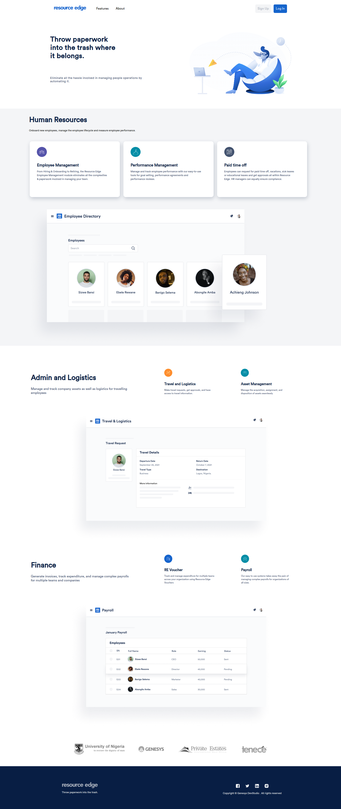

## github repository for Resource Edge

You can checkout the live website [here](https://resource-edge.netlify.app)

### Mobile view

<!-- {width: 100px} -->

    

### Desktop view

    

This project was bootstrapped with [Create React App](https://github.com/facebook/create-react-app).

After cloning the this project, run this command in the project directory.
### `npm install`

to install node dependencies.

then run 
### `npm run start`

to start up the project.

